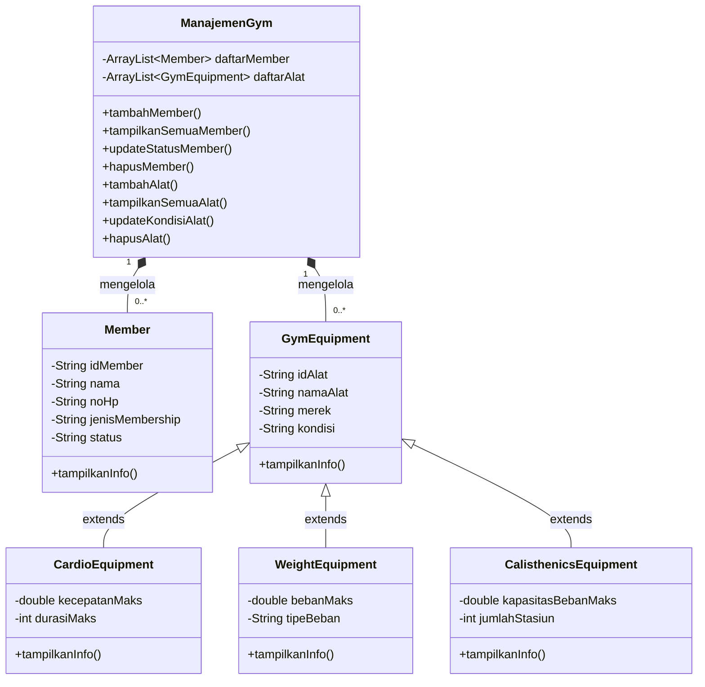
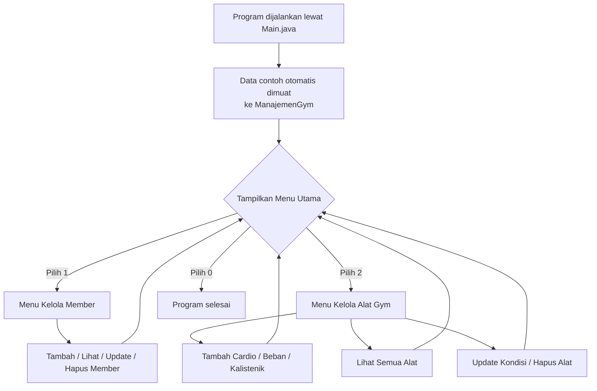

## Identitas Mahasiswa
- **Nama:** Kenny Giovanni Gavra
- **NIM:** 2509116003
- **Mata Kuliah:** Pemrograman Berbasis Objek
- **Kelas:** A 2025

---

## Deskripsi Proyek

**Sistem Manajemen Gym** adalah program berbasis console (command-line) yang dibangun dengan Java, menerapkan konsep **Object-Oriented Programming (OOP)** — khususnya **encapsulation**, **inheritance**, dan **polymorphism**.

### Fungsi Program
Program ini menyediakan operasi **CRUD (Create, Read, Update, Delete)** untuk dua entitas utama:
- **Data Member** — mendaftarkan anggota baru, melihat daftar anggota, mengubah status keanggotaan, dan menghapus data anggota.
- **Data Alat Gym** — mendaftarkan alat baru (cardio, beban, atau kalistenik), melihat seluruh inventaris alat, mengubah kondisi/status alat, dan menghapus data alat yang sudah tidak terpakai.

### Kegunaan Program
Program ini berguna untuk membantu pengelola gym dalam:
1. **Mencatat dan memantau keanggotaan** — memastikan data member (jenis membership, status aktif/tidak aktif) selalu terorganisir dan mudah diakses.
2. **Mengelola inventaris alat olahraga** — mengetahui kondisi tiap alat (baik/rusak/maintenance) sehingga memudahkan jadwal perawatan atau penggantian alat.
3. **Menjadi contoh penerapan konsep OOP** — khususnya inheritance dengan banyak tipe subclass (`CardioEquipment`, `WeightEquipment`, `CalisthenicsEquipment`) yang mewarisi dari satu superclass (`GymEquipment`).

---

## Studi Kasus

Program ini merupakan implementasi **CRUD (Create, Read, Update, Delete)** dengan konsep **Object-Oriented Programming (OOP)** dalam bahasa Java, dengan studi kasus **Sistem Manajemen Gym**.

Latar belakang studi kasus: sebuah gym membutuhkan sistem sederhana untuk mengelola dua jenis data utama, yaitu:

1. **Data Member** — anggota gym beserta status keanggotaannya (jenis membership, status aktif/tidak aktif, dll).
2. **Data Alat Gym** — inventaris alat olahraga yang dimiliki gym, yang terbagi menjadi dua kategori:
   - **Alat Cardio** (contoh: treadmill, sepeda statis) — punya atribut khusus seperti kecepatan maksimal dan durasi maksimal pemakaian.
   - **Alat Beban** (contoh: dumbbell, barbel, mesin beban) — punya atribut khusus seperti beban maksimal dan tipe beban.
   - **Alat Kalistenik** (contoh: pull-up bar, parallel bar) — punya atribut khusus seperti kapasitas beban maksimal pengguna dan jumlah stasiun/pegangan.

Karena alat cardio, alat beban, dan alat kalistenik sama-sama merupakan "alat gym" namun memiliki karakteristik yang berbeda, studi kasus ini cocok diimplementasikan menggunakan konsep **inheritance (pewarisan)**, di mana ketiganya mewarisi atribut umum dari satu induk class yang sama. Ini juga memenuhi syarat *"inheritance dengan minimal 2 tipe"* — bahkan program ini sudah punya **3 tipe** subclass.

---

## Hierarki Class



### Penjelasan Hierarki

| Class | Peran |
|---|---|
| `Member` | Menyimpan data anggota gym (berdiri sendiri, tidak ada relasi inheritance) |
| `GymEquipment` | **Parent/superclass**, menyimpan atribut umum yang dimiliki semua alat gym |
| `CardioEquipment` | **Subclass** dari `GymEquipment`, khusus alat cardio |
| `WeightEquipment` | **Subclass** dari `GymEquipment`, khusus alat beban |
| `CalisthenicsEquipment` | **Subclass** dari `GymEquipment`, khusus alat kalistenik (pull-up bar, parallel bar) |
| `ManajemenGym` | Class manager, menyimpan `ArrayList` dari `Member` dan `GymEquipment`, berisi seluruh logic CRUD |

### Penjelasan Notasi Relasi

- **`<|--` (panah terbuka, garis solid)** → relasi **inheritance/pewarisan**. Contoh: `GymEquipment <|-- CardioEquipment` berarti `CardioEquipment` adalah turunan dari `GymEquipment`.
- **`*--` (diamond terisi)** → relasi **composition**. Contoh: `ManajemenGym "1" *-- "0..*" Member` berarti satu `ManajemenGym` memiliki dan mengelola langsung nol atau banyak (`0..*`) objek `Member` — objek `Member` "hidup di dalam" `ManajemenGym` lewat `ArrayList`.
- Angka `"1"` dan `"0..*"` di kedua ujung garis disebut **multiplicity**, menunjukkan berapa banyak objek yang terlibat dalam relasi tersebut di masing-masing sisi.

### Struktur Package

```
src/
├── Main.java                    (default package)
├── data_gym/
│   ├── Member.java
│   ├── GymEquipment.java
│   ├── CardioEquipment.java
│   ├── WeightEquipment.java
│   └── CalisthenicsEquipment.java
└── operasional/
    └── ManajemenGym.java
```

---

## 🔗 Penerapan Inheritance dalam Kode

Konsep inheritance diterapkan pada relasi antara `GymEquipment` (parent) dengan `CardioEquipment` dan `WeightEquipment` (child).

### 1. Parent Class — `GymEquipment`

Menyimpan atribut yang dibutuhkan oleh **semua** jenis alat gym, agar tidak perlu ditulis ulang di tiap subclass:

```java
public class GymEquipment {
    private String idAlat;
    private String namaAlat;
    private String merek;
    private String kondisi;

    public GymEquipment(String idAlat, String namaAlat, String merek, String kondisi) {
        this.idAlat = idAlat;
        this.namaAlat = namaAlat;
        this.merek = merek;
        this.kondisi = kondisi;
    }

    public void tampilkanInfo() {
        System.out.println("ID: " + idAlat + " | Nama: " + namaAlat + " | Tipe: Umum");
    }
}
```

### 2. Child Class — `CardioEquipment extends GymEquipment`

Kata kunci **`extends`** menandakan bahwa `CardioEquipment` mewarisi seluruh atribut dan method dari `GymEquipment`, lalu menambahkan atribut khusus (`kecepatanMaks`, `durasiMaks`):

```java
public class CardioEquipment extends GymEquipment {
    private double kecepatanMaks;
    private int durasiMaks;

    public CardioEquipment(String idAlat, String namaAlat, String merek, String kondisi,
                            double kecepatanMaks, int durasiMaks) {
        super(idAlat, namaAlat, merek, kondisi); // memanggil constructor parent
        this.kecepatanMaks = kecepatanMaks;
        this.durasiMaks = durasiMaks;
    }

    @Override
    public void tampilkanInfo() {
        System.out.println("... Tipe: Cardio | Kecepatan Maks: " + kecepatanMaks + " km/jam");
    }
}
```

Poin penting penerapan inheritance:
- **`extends GymEquipment`** — mendeklarasikan bahwa `CardioEquipment` (dan `WeightEquipment`) adalah turunan dari `GymEquipment`.
- **`super(...)`** — memanggil constructor milik parent, agar atribut umum (`idAlat`, `namaAlat`, `merek`, `kondisi`) tetap diinisialisasi lewat class induknya, tanpa perlu ditulis ulang.
- **`@Override`** — subclass menimpa method `tampilkanInfo()` milik parent, karena tiap jenis alat perlu menampilkan info tambahan yang berbeda.
- **Polymorphism** — karena `ManajemenGym` menyimpan data dalam `ArrayList<GymEquipment>`, satu baris kode `a.tampilkanInfo()` otomatis memanggil versi method yang sesuai (Cardio atau Weight) tergantung jenis objeknya saat program berjalan.

---

## Cara Menjalankan Program

```bash
javac data_gym/*.java operasional/*.java Main.java
java Main
```

Atau jika menggunakan IDE (NetBeans/Eclipse/IntelliJ), cukup jalankan (Run) file `Main.java`.

---

## Alur Program

### Diagram Alur Eksekusi



### Penjelasan Cara Kerja Sistem

1. **Inisialisasi** — saat program pertama kali dijalankan, `Main.java` membuat satu objek `ManajemenGym` dan langsung mengisinya dengan beberapa data contoh (2 member, 3 alat gym) supaya program tidak kosong saat pertama dicoba.

2. **Menu Utama** — pengguna disuguhkan dua pilihan besar: **Kelola Member** atau **Kelola Alat Gym**, ditambah opsi keluar. Program akan terus menampilkan menu ini berulang (pakai perulangan `do-while`) sampai pengguna memilih keluar (`0`).

3. **Delegasi ke `ManajemenGym`** — `Main.java` sendiri **tidak menyimpan data apapun**. Setiap kali pengguna memilih aksi (misal "Tambah Member"), `Main.java` hanya menampung input dari `Scanner`, lalu meneruskannya ke method yang sesuai di `ManajemenGym` (misal `gym.tambahMember(...)`). Semua logic penyimpanan dan pengolahan data ada di `ManajemenGym`.

4. **Proses CRUD**:
   - **Create** — objek baru (`Member` atau salah satu subclass `GymEquipment`) dibuat dari input pengguna, lalu dimasukkan ke `ArrayList` di dalam `ManajemenGym`.
   - **Read** — `ManajemenGym` melakukan perulangan (`for`) ke seluruh isi `ArrayList` dan memanggil `tampilkanInfo()` di tiap objek. Karena polymorphism, tampilan otomatis menyesuaikan jenis objeknya (cardio/beban/kalistenik).
   - **Update** — program mencari objek berdasarkan ID/nama yang dicocokkan (`equalsIgnoreCase`), lalu mengganti nilai atributnya lewat setter.
   - **Delete** — program mencari objek yang cocok, lalu menghapusnya dari `ArrayList` menggunakan `remove()`.

5. **Kembali ke Menu** — setelah satu aksi selesai (misalnya sudah menambah member), program otomatis kembali menampilkan submenu tersebut, sampai pengguna memilih `0` untuk kembali ke menu utama atau keluar total dari program.

---

## Tangkapan Layar & Penjelasan Gambar

### Menu Utama

#### 1. Tampilan Awal Program


**Penjelasan:** Tampilan pertama saat program dijalankan. Terlihat data contoh (2 member, 3 alat gym) sudah otomatis termuat dari `Main.java`. Pengguna diberi pilihan **Kelola Member**, **Kelola Alat Gym**, atau **Keluar**.

---

### Fitur Kelola Member (CRUD)

#### 2. Submenu Kelola Member


**Penjelasan:** Muncul setelah memilih `1` di menu utama. Menampilkan 4 pilihan operasi CRUD untuk data member.

#### 3. Tambah Member (Create)


**Penjelasan:** Pengguna memasukkan ID, nama, no HP, jenis membership, dan status. Data baru dibungkus jadi objek `Member` lalu ditambahkan ke `ArrayList` lewat `gym.tambahMember(...)`.

#### 4. Lihat Semua Member (Read)


**Penjelasan:** Menampilkan seluruh data member yang tersimpan, termasuk member yang baru saja ditambahkan, hasil perulangan `for` yang memanggil `tampilkanInfo()` di tiap objek `Member`.

#### 5. Update Status Member (Update)


**Penjelasan:** Pengguna memasukkan ID member yang ingin diubah statusnya (misal dari "Aktif" menjadi "Tidak Aktif"). Program mencari objek dengan ID yang cocok lalu mengubah nilainya lewat `setStatus(...)`.

#### 6. Hapus Member (Delete)


**Penjelasan:** Pengguna memasukkan ID member yang ingin dihapus. Objek yang cocok akan dibuang dari `ArrayList` menggunakan `remove(...)`.

---

### Fitur Kelola Alat Gym (CRUD)

#### 7. Submenu Kelola Alat Gym


**Penjelasan:** Muncul setelah memilih `2` di menu utama. Ada 3 opsi Create (berdasarkan subclass), 1 opsi Read, dan 2 opsi Update/Delete yang berlaku untuk semua jenis alat.

#### 8. Tambah Alat Cardio (Create)


**Penjelasan:** Input khusus untuk alat cardio: kecepatan maksimal (km/jam) dan durasi maksimal (menit). Objek yang dibuat bertipe `CardioEquipment`.

#### 9. Tambah Alat Beban (Create)


**Penjelasan:** Input khusus untuk alat beban: beban maksimal (kg) dan tipe beban (Barbel/Dumbbell/Mesin). Objek yang dibuat bertipe `WeightEquipment`.

#### 10. Tambah Alat Kalistenik (Create)


**Penjelasan:** Input khusus untuk alat kalistenik: kapasitas beban maksimal pengguna (kg) dan jumlah stasiun. Objek yang dibuat bertipe `CalisthenicsEquipment`.

#### 11. Lihat Semua Alat (Read) — Bukti Polymorphism


**Penjelasan:** Ini bukti nyata **polymorphism** bekerja — kode hanya memanggil satu baris `a.tampilkanInfo()` untuk tiap objek di `ArrayList<GymEquipment>`, tapi hasil outputnya berbeda format sesuai jenis alatnya masing-masing (cardio menampilkan kecepatan & durasi, beban menampilkan beban & tipe, kalistenik menampilkan kapasitas & jumlah stasiun).

#### 12. Update Kondisi Alat (Update)


**Penjelasan:** Pengguna memasukkan ID alat dan kondisi baru (Baik/Rusak/Maintenance). Method ini berlaku untuk semua jenis alat karena `kondisi` adalah atribut yang diwarisi dari `GymEquipment` (parent).

#### 13. Hapus Alat (Delete)


**Penjelasan:** Pengguna memasukkan ID alat yang ingin dihapus. Objek yang cocok (apapun jenisnya) akan dibuang dari `ArrayList<GymEquipment>`.

---
